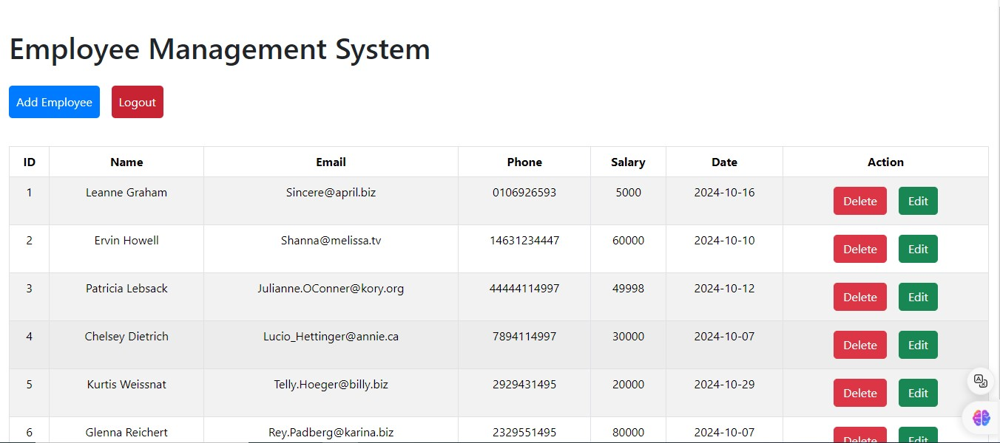

<h1 align="center">
  <a href="">
    CRUD App
  </a>
</h1>
<p align="center">
  A simple and beautiful <a href="https://www.codecademy.com/articles/what-is-crud">CRUD</a> application built with <a href="https://reactjs.org">React</a>.
</p>



## Technologies Used

- [React](http://reactjs.org)
- [Primitive UI](https://taniarascia.github.io/primitive)
- [SweetAlert2](https://sweetalert2.github.io)

## Development

To get a local copy of the code, clone it using git:

```
git clone https://github.com/SafdarJamal/crud-app.git
cd crud-app
```

Install dependencies:

```
npm install
```

Now, you can start a local web server by running:

```
npm start
```

and then you can open http://localhost:3000 to view it in the browser.

#### Available Scripts

| Script        | Description                                                             |
| ------------- | ----------------------------------------------------------------------- |
| npm start     | Runs the app in the development mode.                                   |
| npm test      | Launches the test runner in the interactive watch mode.                 |
| npm run build | Builds the app for production to the `build` folder.                    |
| npm run eject | This command will remove the single build dependency from your project. |

## Credits

CRUD App is built and maintained by [Safdar Jamal](https://CodeWithMariam.github.io).

## License

CRUD App is open-source software licensed under the [MIT License](https://github.com/CodeWithMariam/crud-app/blob/master/LICENSE).
